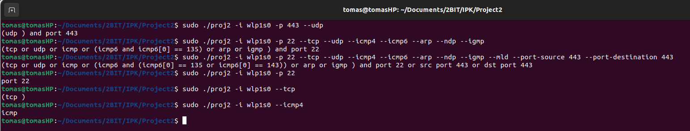
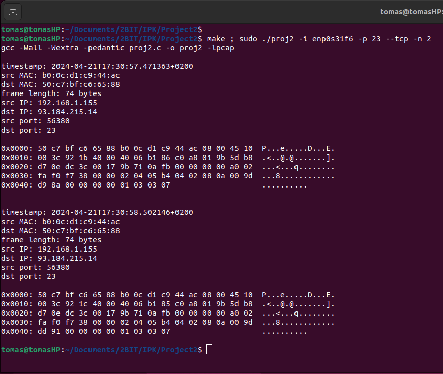
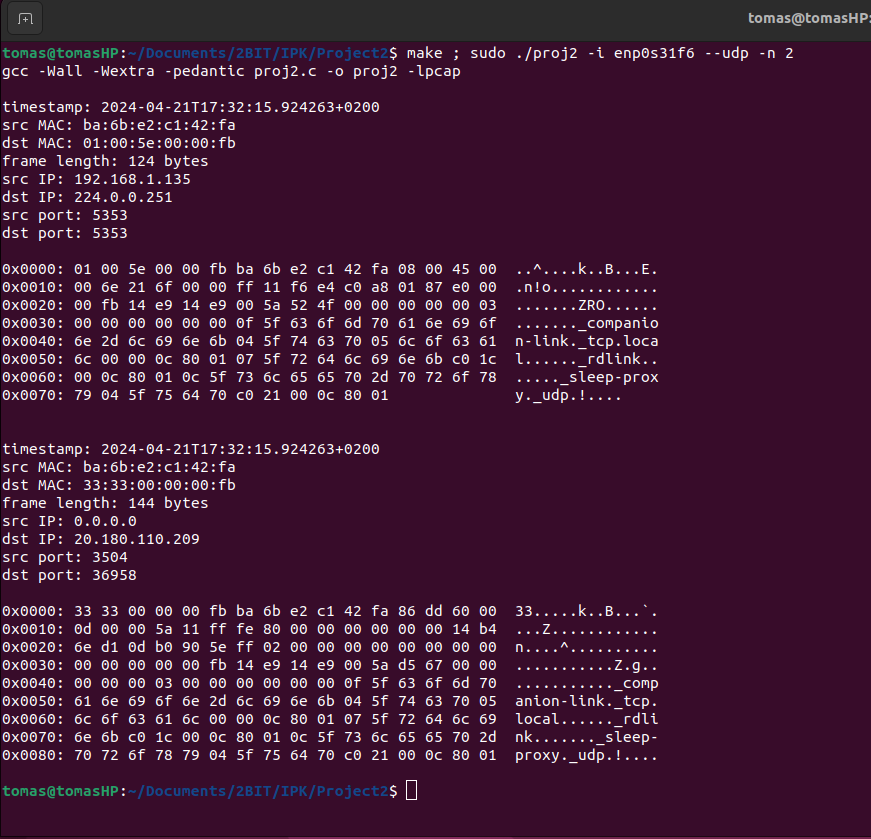
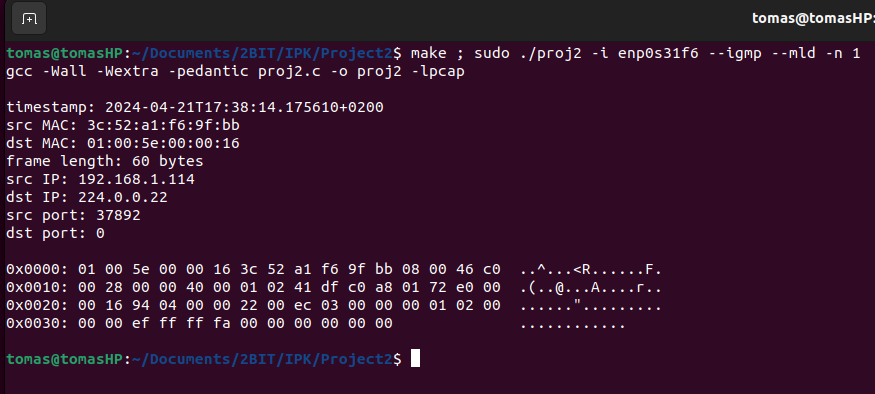
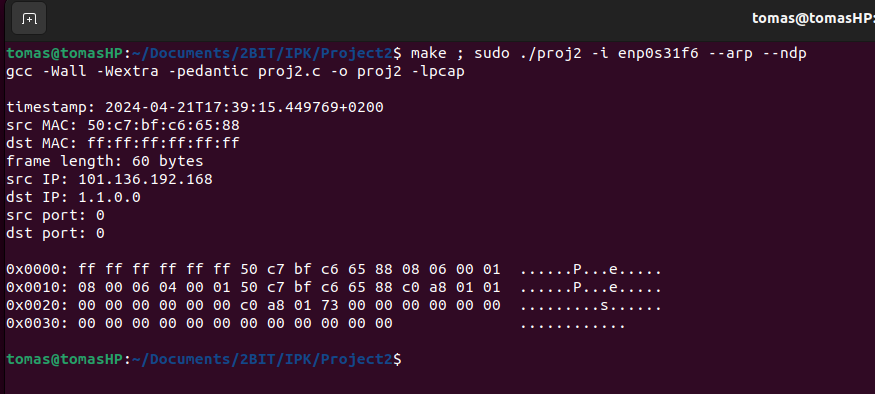
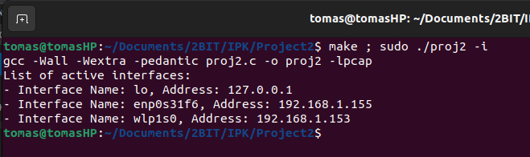
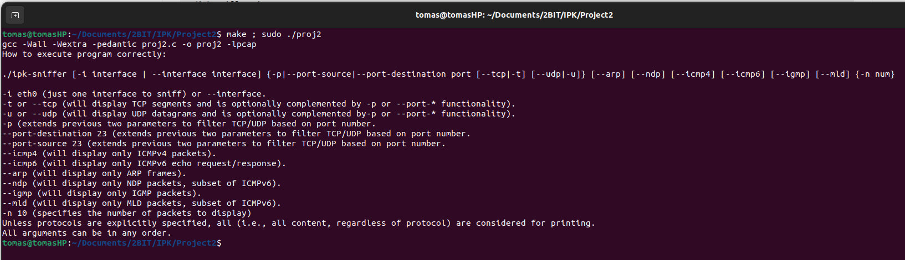
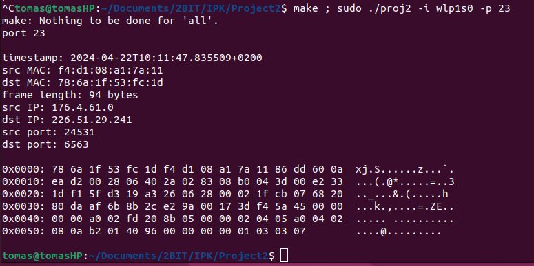
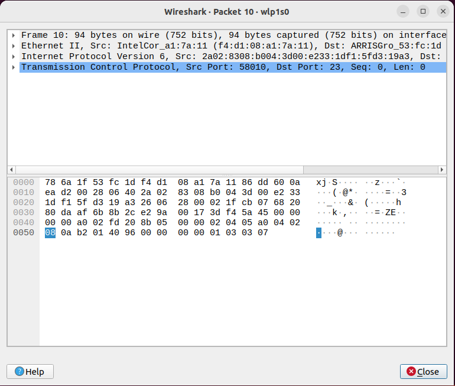

# Dokumentace k druhému projektu do předmětu IPK - Síťový sniffer

### Autor: Tomáš Řezníček
### Login: xrezni33
### Datum: 21.04.2024

## 1. Úvod
Cílem projektu bylo vytvořit síťový sniffer, který bude zobrazovat informace o packetech. Zobrazované packety lze filtrovat pomocí vstupních argumentů. Povolené kombinace filtrů lze zobrazit pomocí --help nebo -h. Pro implementaci projektu jsem si vybral jazyk C, jelikož s ním mám největší zkušenosti a po nastudovaní funkcí knihovny **pcap** jsem měl poměrně dobrý přehled o tom, jak tento projekt v daném jazyce vytvořit. Program se skládá ze dvou souborů, a to hlavičkového souboru **proj2.h** a hlavního programu **proj2.c**. Dále se zde nachází soubor **Makefile** a dokumentace v podobě MD souboru.

## 2. Teorie

### 2.1 TCP (Transmission Control Protocol)
Jedná se o spolehlivý protokol využívaný v počítačové komunikaci. Jeden TCP packet může obsahovat buď pouze část zprávy, tak i více zpráv najednou. Protokol zajišťuje úspěšné přijetí každého packetu, což vede k vyšší režii.

### 2.2 UDP (User Datagram Protocol)
Jedná se o jednodušší ale méně spolehlivý protokol. Je rychlejší než TCP, ale na úkor jeho spolehlivosti. Tento typ protokolu je obvykle používán pro přenos velkého množství dat, u kterých není problémem občasná ztráta packetu. Díky tomu tento protokol disponuje nižší režií než výše uvedené TCP.

### 2.3 IP - ICMP4 a ICMP6
IP je protokol, který je nejčastěji používaným pro směrování dat v síti. ICMP4 je variantou pracující s adresami typu IPv4 a ICMP6 pracuje s adresami v6. 

### 2.4 NDP (Neighbor Discovery Protocol)
Protokol používaný s ICMP6 pro automatické nastavování adres a jak vyplývá z názvu, taktéž pro objevování sousedů.

### 2.5 MLD (Multicast Listener Discovery)
Další z protokolů používáných ve spojitosti s ICMP6. Tento protokol zajišťuje správu členství v sítích využívajících multicast.

## 2. Implementace

### 2.1 Obecné informace
Celý program je založen na knihovně **pcap** a funkcích, které tato knihovna poskytuje. Tato knihovna byla doporučena zadáním a poskytuje veškerou funkcionalitu, která byla pro řešení projektu nezbytná.

 Projekt byl vyvíjen za pomoci verzovacího systému GitHub. I přes doporučení používat školní verzovací systém Gitea, jsem se rozhodl tak neučinit a používat jinou platformu. Hlavním důvodem byl fakt, že projekt byl střídavě vytvářen na třech různých zařízeních (PC, notebook, iPad), kde GitHub aktivně již několik let používám a mám ho zde korektně nastavený. Bylo by pro mě nepraktické přenastavovat všechna zařízení na jiný verzovací systém. Finální verze projektu je samozřejmě nahrána na školní Giteu.

### 2.2 Zpracování argumentů
První částí programu je zpracování argumentů. Toto zpracování probíhá ve funkci **argsParse**. K uložení zpracovaných argumentů slouží struktura **Arguments** definovaná v hlavičkovém souboru **proj2.h**. Funkce do dané struktury postupně uloží zpracované argumenty, povětšinou se jedná o proměnné typu bool, v případě argumentů rozhraní a portů se jedná o pole znaků, respektive řetězec. V první verzi projektu byly hodnoty portů ukládány jakožto číselná hodnota int, ale pro jednoduchost vytváření filtrovacího řetězce se nakonec ukládají jako řetězec po celou dobu. Při zpracovávání se také kontroluje, jestli nebyl některý z argumentů zadán více než jednou. V takovém případě program vypíše odpovídající chybovou hlášku a ukončí se.

### 2.3 Práce s rozhraním
Výpis dat probíhá vždy pouze z jednoho konkrétního rozhraní. Toto rozhraní je zvoleno argumentem -i nebo --interface při spuštění programu. Pokud je zadáno pouze -i|--interface bez hodnoty, program vypíše všechna aktivní rozhraní, ze kterých je možné odposlouchávat data a ukonční program s návratovým kódem indikujícím úspěšný průchod (0). V případě zadání rozhraní, které není validní skončí program chybou. Tato chyba je odhalena při volání funkce **pcap_open_live**. V takovém případě vypíše program odpovídající chybovou hlášku a skončí s návratovým kódem různým od nuly, značícím neúspěch.

### 2.4 Tvorba filtrovacího řetězce
Knihovna **pcap**, respektive její funkce, používají pro filtrování filtrovací řetězec. Tento řetězec je nutné vygenerovat ze vstupních argumentů a poté ho předat funkci **pcap_compile**, která se ho pokusí zkompilovat. Vytváření řetězce probíhá ve funkci **filterString**, která postupně prochází argumenty, které jí byly předány v dříve specifikované struktuře, a vytváří výsledný řetězec. Některé chyby, například v nekompabilitě některých kombinací argumentů, jsou ošetřeny již zde, jiné jsou ošteřeny až po odhalení funkcí pcap_compile. 

### 2.5 Příprava na zpracovávání dat
Vytvořený filtrovací řetězec je poté předán funkci **pcap_compile**, která ho zkompiluje a připraví pro následné použítí. Pří úspěšné kompilaci program pokračuje k funkci **pcap_setfilter**, která dříve zkompilovaný řetězec nastaví jako reálné filtrovací hodnoty. Poté program pokračuje k funkci **pcap_loop**, která již zajišťuje čtení jednotlivých datových packetů. Důležitým parametrem této funkce je parametr určující počet packetů, které má funkce před ukončením zpracovat. Dále se funkci předá název funkce, která bude mít zpracování jednotlivých packetů na starosti.

### 2.6 Zpracovávání packetů a výpis
Tuto funkci v mém programu zastává funkce **packetHandler**. Funkce dostane pomocí argumentů informace o packetu, které zpracuje a požadované údaje vypíše na standartní výstup STDOUT. Prvním požadovaným údajem je **timestamp** (časové razítko). Toto razítko je získáno z hlavičky packetu. Pro větší přehlednost kódu byla tato funkcionalita oddělena do samostatné funkce **getTimestamp**, která navrátí řetězec obsahující požadovaný timestamp. Dalšími údaji, které jsou vypisovány, jsou **MAC adresy** odesílatele a příjemce. Tyto informace jsou získány z konrétních bytů datové části packetu. Poté program vypíše **délku packetu** v bajtech, kterou získá z hlavičky packetu. Dále jsou vypsány informace o **IP adrese** odesílatele a příjemce, které jsou získány obdobně jako v případě MAC adresy. Poslední informací o packetu je **zdrojový (source) a cílový (destination) port**. Informace o portech se vypíšou pouze v případě, že se jedná o TCP nebo UDP packety. Přičemž pro každý ze zmíněmých se hodnoty portů získávají vlastním způsobem. Poté už je vypsán **obsah packetu**, a to nejprve v hexadecimální a následně ASCII podobě.

### 2.7 Ukončení programu
K úspěšnému ukončení programu může dojít dvě způsoby. Prvním z nich je, že byl při spuštění zadán počet packetů, které mají být zobrazeny, tudíž po zobrazení *n* packetů dojde k ukončení programu. Program se vrátí do hlavní funkce **main**, kde následuje volání funkce **pcap_close**, která zajistí bezpečné ukončení všech funkcí knihovny pcap. Poté dojde k uvolnění dynamicky alokované paměti a ukončení programu. Druhým způsobem je stisknutí Ctrl+C v jakékoliv fázi programu. Správnost ukončení programu zajišťuje funkce **SIGDetected**, která za pomoci knihovny **signal** zajišťuje správné zpracování signálu SIGINT. 

### 2.8 Error handling
V případě chyby, dojde k výpisu chybové hlášky popisující problém na standardní chybový výstup **STDERR** a ukončení programu s odpovídajícím chybovým kódem. Jednotlivé chybové kódy jsou popsaný níže nebo v hlavičkovém souboru.

## 3. Testování
Testování probíhalo v prostředí operačního systému Ubuntu ve verzi 22.04. Testy byly vytvářeny v době, kdy program neměl finální název, proto jsou testy spouštěny pomocí ./proj2. Pro úspěšné spuštění programu je nutné oprávnění správce.

### Prvotní testy probíhaly formou výpisu filtrovacího řetězce a ukončení programu

### Filter Tests:

### Další testy již probíhaly i s výpisem zpracovaných packetů

### Test1 - TCP komunikace na portu 23:

### Test2 - UDP komunikace:

### Test3 - MLD a IGMP packety:

### Test4 - ARP a NDP packety:

### Test5 - Aktivní rozhraní

### Test6 - Žádné argumenty

### V další fázi testování jsem porovnával výstup mého souboru s výstupem z programu Wireshark

### Test7 - Porovnávání s Wireshark
### Můj výstup

### Wireshark výstup

## 4. Návratové kódy
**Jednotlivé návratové kódy a jejich význam:**

**0**: Úspěšný průchod programu\
**99**: Intrerní chyba programu\
**12**: Neznámý vstupní argument\
**13**: Duplicitní vstupní argumenty\
**14**: Špatná hodnota vstupních argumentů\
**15**: Nedovolená kombinace vstupních argumentů nebo chyba při kompilování vstupního řetězce\
**16**: Nesprávné rozhraní

## 5. Bibliografie

### Využívané manuály
- PCAP manual: https://www.tcpdump.org/manpages/pcap.3pcap.html
- PCAP manual 2: https://linux.die.net/man/3/pcap 
- PCAP filter functions: https://www.tcpdump.org/manpages/pcap-filter.7.html
- NETINET/in manual: https://man7.org/linux/man-pages/man0/netinet_in.h.0p.html
- NETINET/ip manual: https://pubs.opengroup.org/onlinepubs/009695399/basedefs/netinet/in.h.html
- NETINET/ip manual 2: https://man7.org/linux/man-pages/man7/ip.7.html 

### Zadání projektu: 
- https://git.fit.vutbr.cz/NESFIT/IPK-Projects-2024/src/branch/master/Project%202/zeta \
- https://git.fit.vutbr.cz/NESFIT/IPK-Projects-2024#developer-environment-and-virtualization-remarks

### Teorie k protokolům

- TCP: https://en.wikipedia.org/wiki/Transmission_Control_Protocol\
- UDP: https://en.wikipedia.org/wiki/User_Datagram_Protocol\
- ICMP: https://en.wikipedia.org/wiki/Internet_Control_Message_Protocol\

## 6. Závěr
Ze začátku se projekt jevil jakožto jeden z těch obtížnějších, ale po podrobném nastudováním potřebných informací se tento názor diagonálně změnil. Na vlastní implementaci programu jsem strávil přibližně 10-15 hodin, což je v porovnání s ostatními podobně bodově ohodnocenými projekty opravdu málo. Díky tomuto projektu jsem objevil schopnosti a funkce knihovny pcap a získal nové znalosti datové komunikace a jednotlivých protokolů.