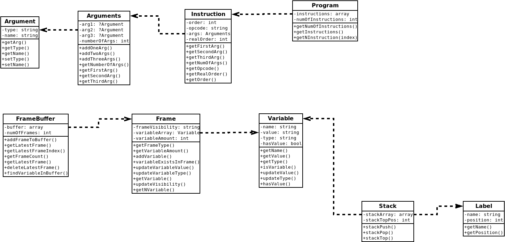

# Interpreter of XML code
## Project evaluation
### 10/13 points

## Before running this program do the folowing steps:
        git clone https://git.fit.vutbr.cz/IPP/ipp-core.git
        cd ipp-core
        php8.3 composer.phar install
### Replace student directory with one on my Git repo if needed

# Implementační dokumentace k 2. úloze do IPP 2023/2024
### Jméno a příjmení: Tomáš Řezníček
### Login: xrezni33

## 1. Úvod
Úkolem tohoto projektu je vykonání sémantické analýzy a provedení vstupního XML kódu, který jsme získali pomocí první části projektu. Povinnou součástí řešení je využití objektového přístupu k programování a to v jazyce php ve verzi 8.3.

## 2. Implementace
### 2.1 Zpracování XML kódu
Zpracování XML kódu probíhá v souboru **XMLtoOPCode.php**. Soubor dostane z hlavního programu instanci třídy DOMDocument, ve které je uložen obsah vstupního souboru. Funkce *parse_xml()* postupně projde vstupním kódem, zkontroluje jeho validitu a vytvoří pole instrukcí. Dále tato funkce také případně uspořádá instrukce a argumenty do správného pořadí, pokud je jejich pořadí proházené. Po průchodu celým vstupním kódem funkce vrátí instanci třídy program, do které uloží všechny získané informace.

### 2.2 Funkce implementované v hlavním souboru
V hlavním souboru **Interpreter.php** bylo poté implementováno několik dodatečných funkcí, které zajistili vyšší přehlednost kódu a méně duplicitních částí. Mezi nejčastěji používané patří funkce *varFrame* a *varName*, které vrací jméno proměnné, nebo rámec, ve kterém se nachází. Další z často používaných funkcí je funkce *getVariableFromFrames()*, která vrací instanci Variable s požadovanou proměnnou.

### 2.3 Hlavní část projektu - zpracování kódu
Zpracování kódu probíhá ve smyčce for, která prochází postupně přes všechny instrukce. Zde se nachází switch, který hledá správný opcode a poté dojde k jeho zpracování. U každé instrukce se kontroluje, zda-li obsahuje správný počet argumentů.

### 2.4 Použíté třídy
Při tvorbě programu bylo třeba vytvořit 9 tříd. Hlavní třídou se dá nazvat třída **Program**, která uchovává všechny instrukce programu. V této třídě se nachází pole instancí třídy **Instruction**. Každá instrukce obsahuje instanci třídy **Arguments** a ta obsahuje jednu, dvě nebo tři instance třídy **Argument** podle toho, kolik má daná instrukce argumentů. Dále byla implementována třída **FrameBuffer**, která slouží jako zásobník instancí třídy **Frame**. Používá se výhradně pro lokální rámce. Každý frame obsahuje pole instancí třídy **Variable**. Dále byla implementována třída **Stack** která má dvě odlišná využití. V programu jsou vytvořené dvě instance této třídy, s tím, že jedna se používá jako zásobník instancí třídy **Label** a druhá jako zásobník instancí třídy **Variable**.

### 2.5 Vypořádání se s chybami (Error handling)
Při nalezení chyby dojde k vypsání příslušné chybové hlášky na standartní chybový výstup STDERR a ukončení programu s odpovídajícím návratovým kódem. Pro výpis chybových hlášek je využita funkce fwrite, která je směřuje na STDERR a k ukončení programu funkce exit, která jako argument dostane jeden z kódů definovaných v souboru **ReturnCode.php**

## 3. Testování
Testování probíhalo primárně pomocí vlastních testů, které jsem skrze script automaticky spouštěl. Průběžně jsem také testoval program pomocí phpstan. Výsledný program je v aktuální verzi na úrovni 7 bez chyb. Ve finální fázi jsem vyzkoušel i některé testy sdílené ostatními studenty, ale kromě pár drobných nesrovnalostí v návratových kódech jsem se s žádnými většími odchylkami výsledků nesetkal.

## 4. Diagram tříd

## 5. Závěr
Projekt byl jedním z prvních projektů, kde jsem se ve větší míře setkal s objektovým přístupem. I přes to, že jsem nebyl největším fanouškem tohoto přístupu, musím uznat, že pro tento projekt byl mnohem vhodnější. Jediným mínusem, kterého jsem si u mého projektu vědom, je absence většího množství komentářů v souboru **Interpreter.php**. Tento kód mi i přes svoji délku přijde jako velmi jednoduše pochopitelný a nevidím smysl v tom, přidávat do něj více komentářů. Jednotlivé soubory se třídami jsou okomentované podrobněji, aby bylo jednoznačné, jakého typu mají být vstupní argumenty, jakého typu bude případná návratová hodnota, nebo co přesně daná funkce dělá.